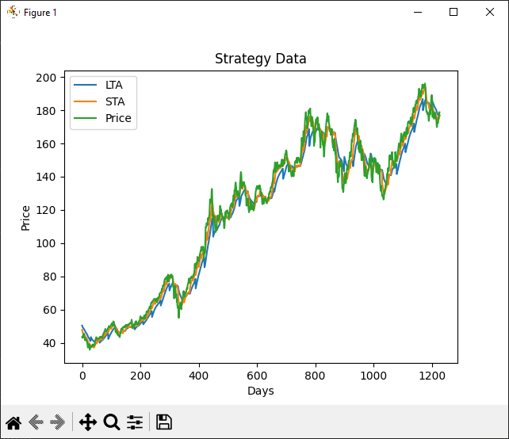

# Mercury

Event Driven Backtesting Framework



Visualizing a mean reversion.

### Building

This is a cmake project so simply run `cmake` and then `cd build && make`. Make sure you have some sort of c++ compiler that is detected by cmake.

### Running

Mercury requires a config.json file to run. Here is a sample one:

```json
{
  "historical_data": "AAPL.csv",
  "strategy": {
    "name": "MEAN_REVERSION",
    "moving_average": "EMA",
    "days": {
      "short_term": 10,
      "long_term": 30
    },
    "smoothing": 2,
    "output": "output.csv"
  },
  "capital": 10000,
  "positions": [
    {
      "symbol": "AAPL",
      "quantity": 0,
      "price": 0
    }
  ],
  "slippage": 0.005,
  "transaction_cost": 0.001,
  "start_date": "2018-10-12",
  "end_date": "2023-10-11"
}
```

then simply run `mercury -c /path/to/config.json`
